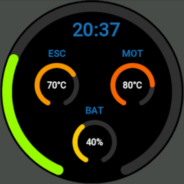

## status

App is waiting for approval from Zepp

if you would like to test it now scan this code in developer mode of your android zepp app:

[✔] Please use Zepp APP to scan the following QR code to preview your Application.

[✔] This QR code will expire on 2025-07-20 21:46:12.

[Amazfit GTR 4] Vesc View-1.0.0

## preview

## links

https://developer.zepp.com/os-post/easy-ble-advanced-comms-between-a-zeppos-watch-and-ble-peripherals

https://docs.zepp.com/docs/reference/device-app-api/newAPI/ble/addListener/

https://github.com/zepp-health/easy-ble

https://github.com/vedderb/vesc_tool/blob/master/bleuart.cpp#L239

https://github.com/thankthemaker/rESCue/blob/master/src/BleServer.cpp

https://docs.zepp.com/docs/guides/framework/device/layout/

https://www.youtube.com/watch?v=18rByxNqs10

https://console.zepp.com/#/service/app/audit/form/create/app

## commands

source /usr/share/nvm/init-nvm.sh

zeus dev

zeus build

zeus preview
